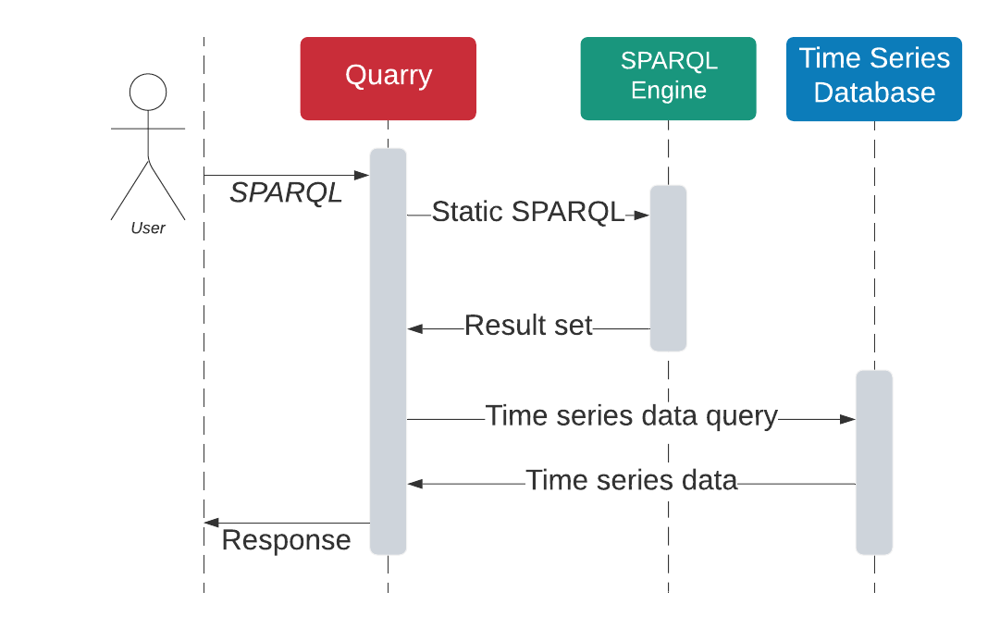

# Quarry
This repository provides prototype Python tools for: 
- translating OPC UA NodeSet2 XML files to semantic web technologies (SWT) 
- jointly querying OPC UA information models in a SPARQL database and data in a time series database

This allows the addition of information models to existing time series database / data lake / historian infrastructure.\
The code is part of a (hopefully!) forthcoming paper. 
## Overview
### Translation
First, OPC UA NodeSet2 xml files corresponding to OPC UA Information Models are parsed. We translate to the Semantic Web corresponding to the translation described in the associated paper. 
Turtle-files (.ttl) are produced, and these may be loaded into an arbitrary SPARQL database. For queries over models and time series data to to work, it is assumed that a time series database exists. 
We will use the term Signal ID to refer to data identifiers in this time series database. We assume that these Signal IDs can be linked to OPC UA Variable Nodes from the OPC UA Information Model in the Nodeset2 XML-files, and expect a comma separated file to contain this information.
### Queries
\
Queries are preprocessed using [RDFLib](https://github.com/RDFLib/rdflib) in order to: 
- removes references to data in the time series database, such as variables and filters they occur in
- add query variables resolving the Signal ID corresponding to a UA Variable

We use [SPARQLWrapper](https://github.com/RDFLib/sparqlwrapper) and wrap the SPARQL endpoint. 
The modified SPARQL query is sent to this endpoint. Based on the response from this endpoint and the original query, one or more queries targeting a time series database is produced.
We combine the results of the SPARQL query and the responses from the time series database using [Pandas](https://github.com/pandas-dev/pandas) to produce the full result.
## Example
Example goes here, soon...\
Look at tests/test_split_query.py for an example meanwhile. 

## Usage
### Translation
To translate import the swt_translator package and call the translate function.
```
import swt_translator as swtt
swt.translate(...)
```
The translate function has the following arguments:
```
translate(xml_dir: str, 
          namespaces: List[str], 
          output_ttl_file: str, 
          output_owl_file: Optional[str] = None,
          subclass_closure: bool = False, 
          subproperty_closure: bool = False,
          signal_id_csv: Optional[str] = None):
```
- **xml_dir** is path to the directory containing OPC UA NodeSet2 xml files. Note that this directory also must contain the base node set, all type libraries used and namespace containing instances. 
- **namespaces** is a list of the preferred order of namespaces. The first element in this list should be http://opcfoundation.org/UA/. Namespaces in XMLs not found in this list are simply given the next available index.
- **output_ttl_file** is the path where the triples produced by translation should be written.
- **output_owl_file** is the path where the XML containing the OWL ontology with subproperty/subclass relations should be written. If no such path is supplied, no file is written. 
- **subclass_closure** set to True will introduce the all rdfs:type properties implied by the ObjectType and VariableType HasSubtype hierarchy in OPC UA. 
- **subproperty_closure** set to True will introduce triples with references implied by the ReferenceType HasSubtype hierarchy in OPC UA.
- **signal_id_csv** is the path to the file containing signal ids. See [this file](https://github.com/PrediktorAS/quarry/blob/main/tests/input_data/query_split/signal_ids.csv) for an example signal id file. 

#### Queries
To query, first set up a SPARQL endpoint using the file(s) produced in translation.
Also, implement the TimeSeriesDatabase-class, and instantiate it with your time series database.
```
import quarry
df = quarry.execute_query(...)
```
```
execute_query(sparql: str, 
              sparql_endpoint: SPARQLWrapper,
              time_series_database: TimeSeriesDatabase)
```
- **sparql** is the SPARQL-string.
- **sparql_endpoint** is the SPARQL endpoint where the file(s) from translation have been deployed.
- **time_series_database** is the time series database where the time series data is located.

##### Time series database support
In the tests, a PostgreSQL docker image is used to store time series data.
Support can however be added for other time series databases in the following way. 

... TBD

## Known issues
- We currently do not implement a SPARQL endpoint as this is outside of the scope of the prototype. 
- The result combination approach is currently somewhat ad hoc, as we rely on suffixes of column names in order to combine the result correctly.
- Signal IDs are currently natural numbers only.  
## License
The code in this repository is copyrighted to [Prediktor AS](http://prediktor.com), and is licensed under the Apache 2.0. \
Exceptions apply to some of the test data (see document headers for license information). 

Author:
[Magnus Bakken](mba@prediktor.com)

